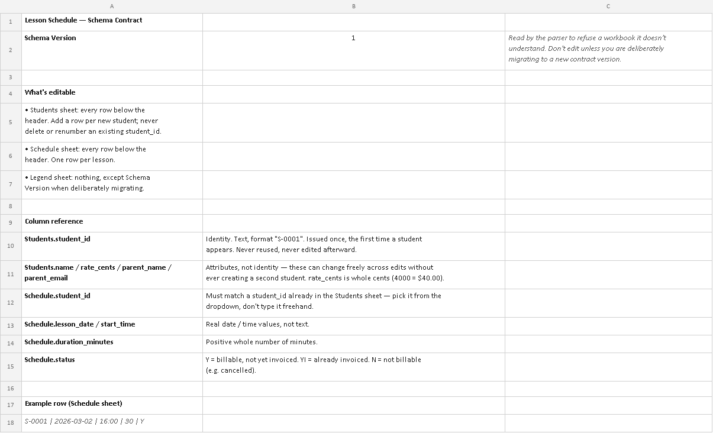
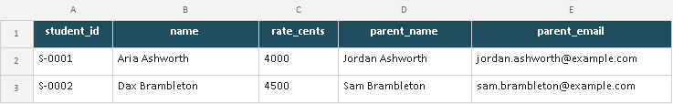
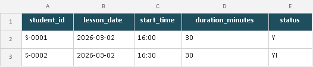
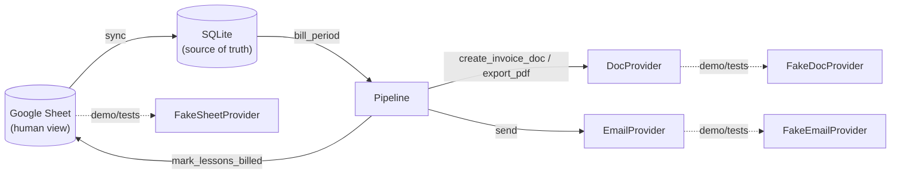
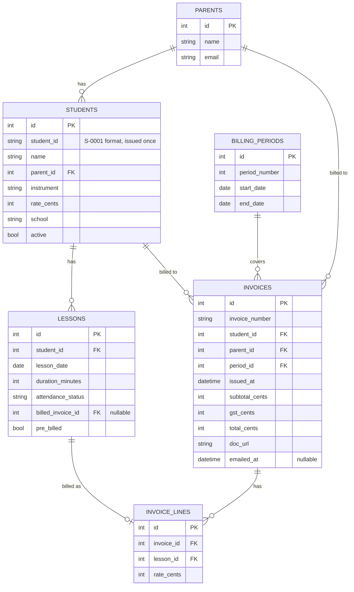

# automated-invoicing-system

Fortnightly tutoring invoicing: bill unbilled lessons, generate invoice documents, email them out. SQLite is the source of truth, Google Sheets is a human-facing view.

[](https://github.com/Bergstefann/automated-invoicing-system/actions/workflows/ci.yml)

## The problem

I run a small private tutoring business. Every fortnight I had to work out which lessons hadn't been billed, write an invoice for each student, and email it to their parent.

The original version did that in about four hours of scripting. A Google Sheet doubled as both the lesson schedule and the billing database, a couple of scripts walked the grid looking for `Y` cells, and a third copied a Google Doc template, filled in placeholders, and sent it through Gmail. It worked, and it still runs my actual invoicing today.

It also wasn't testable. Billing state lived entirely in spreadsheet cell values, so "did this lesson get billed" meant re-parsing a grid. There was no way to run the pipeline against fake data: every test run was a real run against real students, real parents, and a real Gmail account.

This repository is a from-scratch rebuild of the same pipeline. Same business rules, same visual output, but built around a real database, tested end to end with zero network access, and safe by default.

## Incidents

[**Double-billing from a forked student identity**](docs/POSTMORTEM-double-billing.md) (2026-08-16). A parent's contact email changing between two syncs forked a duplicate student record, and a real run billed and partly emailed 44 invoices instead of 22. Root-caused from the live database, fixed, and covered by a regression test. The full writeup, including what's still open, is at the link.

Much of the design below is a direct response to it.

## Try it in 30 seconds

```bash
git clone https://github.com/Bergstefann/automated-invoicing-system.git
cd automated-invoicing-system
python -m venv .venv && .venv/Scripts/activate   # or source .venv/bin/activate
pip install -e . ruff mypy pytest pytest-cov
invoicing run --period 3 --demo --no-dry-run --confirm
```

`--demo` swaps in fake Sheets/Docs/Gmail providers and a synthetic dataset (fictional students, `@example.com` addresses) seeded into a local `demo.db`. No Google credentials, no network access, nothing external touched.

Real output from that command:

```
Period 3: billed 15 new invoice(s).
Emails sent: 15
```

Run it again and nothing happens, because the pipeline already billed those lessons:

```
$ invoicing run --period 3 --demo --no-dry-run --confirm
Period 3: billed 0 new invoice(s).
Emails sent: 0
```

Check state at any point:

```
$ invoicing status --demo
Period  Range                     Invoices   Emailed   Pending
--------------------------------------------------------------
1       2026-02-02 - 2026-02-15         18        18         0
2       2026-02-16 - 2026-03-01         18        18         0
3       2026-03-02 - 2026-03-15         15        15         0
4       2026-03-16 - 2026-03-29          0         0         0
5       2026-03-30 - 2026-04-12          0         0         0
6       2026-04-13 - 2026-04-26          0         0         0
```

Periods 1 and 2 come seeded as already billed, so the dataset looks like a business partway through a term rather than an empty shell.

## Architecture

The original made the spreadsheet the database. A lesson's billing state *was* whatever string sat in its status cell, and answering "what still needs billing" meant re-parsing the whole grid. That made two things hard: verifying state, and testing anything without touching the real Sheet, Drive, and Gmail account.

This rebuild makes SQLite the source of truth. `lessons.billed_invoice_id` is a real, queryable column. A lesson is billed if that column is set, or if `pre_billed` is (a disclosed second signal that `sync` sets for lessons the Sheet already reported as invoiced before this system existed). The Sheet becomes a read source and a write-back target, not where billing decisions get made.

Everything that talks to Google sits behind three Protocols: `SheetProvider`, `DocProvider`, `EmailProvider`. The pipeline depends on those exclusively and never imports the concrete Google classes. Every test, and `--demo` mode, wires up in-memory fakes instead. That's what makes the whole thing runnable and testable with zero credentials and zero network access.

### Schedule schema contract and student identity

[The double-billing incident](docs/POSTMORTEM-double-billing.md) happened because student identity was never anything but a name, looked up transitively through a parent's contact email — a field that legitimately changes. [`docs/SCHEDULE-SCHEMA.md`](docs/SCHEDULE-SCHEMA.md) is the structural fix: a versioned schema contract (`invoicing.schedule_contract`) that makes `student_id` — text, `S-0001` format, issued once, never derived from name or email — the only identity a student or a scheduled lesson ever has. Name, rate, and contact details are attributes, explicitly not identity, and can change freely without ever forking a second student.

The contract is validated two ways:

- **`templates/lesson_schedule.xlsx`** — the contract as a real, usable workbook: a Legend sheet (schema version, column glossary), a Students sheet (the identity register), and a Schedule sheet (one row per lesson, `student_id` validated against the register via dropdown, not free text). It's simultaneously the spec, a fillable template, and a test fixture — `tests/unit/test_workbook.py` loads this exact committed file through the real loader, so the doc and the code can't silently drift apart. Read via `invoicing.workbook.load_schedule_workbook`.
- **The live Google Sheet, unchanged in layout** — `GoogleSheetProvider` still parses its native wrapped weekly-block grid the way it always has (that's a property of the live Sheet, out of scope for this work), then `sync_schedule_into_db` resolves each Sheet-native first name to the database's `student_id` once, at sync time. From there on — critically, including the Sheet write-back that `mark_lessons_billed` performs after billing — `student_id` is what moves, never a re-derived name. That write-back path used to reconstruct a first name by splitting the database's display name (`student.name.split()[0]`), which is exactly the kind of fragile, mutable-field lookup that caused the original incident; it's now keyed by `student_id` throughout, via an identity map built once from the same join that creates the identity.

| Legend | Students (identity register) | Schedule (one row per lesson) |
|---|---|---|
|  |  |  |

The workbook loader is fully implemented and tested but not yet wired into the CLI as a live source — see ["What I'd do next"](#what-id-do-next).



## Business rules

The test suite exists to prove these hold:

1. **Idempotency.** A lesson is never billed twice. Once `billed_invoice_id` is set it's excluded from every future query, so re-running on an already-billed period creates zero new invoices.
2. **Only attended lessons are billable.** Absences are excluded, notified or not.
3. **Period boundaries are exact and inclusive.** A lesson on a boundary date lands in exactly one 14-day period.
4. **Invoice numbers are unique** and follow the original scheme (`DDMMYY` plus a 2-digit daily sequence). Grounded in a database count rather than an in-process rank, so two runs on the same day can't collide. The original could.
5. **Totals are correct.** Integer cents throughout, no floats. GST is hardcoded to `$0.00`, matching the original, which never calculated it either. A disclosed simplification, not a solved feature.
6. **Dry-run changes nothing.** No writes to the database, the Sheet, or email.
7. **Partial failure doesn't corrupt state.** Billing and emailing are independent phases: billing creates an invoice with `emailed_at = NULL`, and a separate phase sends every invoice still `NULL`. If a batch send fails partway, sent invoices stay sent and the rest stay queued. The next run resumes exactly where it left off.

## Data model



## CLI reference

| Command | Flags | Does |
|---|---|---|
| `invoicing sync` | `--demo` \| `--real` (exactly one, required) | Pull the Sheet into SQLite, or seed the synthetic dataset in demo mode. |
| `invoicing preview` | `--period N`, `--demo` | Show what would be invoiced. Read-only, zero writes. |
| `invoicing run` | `--period N`, `--dry-run/--no-dry-run` (default `--dry-run`), `--confirm`, `--demo` \| `--real` (exactly one, required), `--message` | Bill unbilled lessons, then email the results. `--no-dry-run` alone bills but sends nothing. `--confirm` is required to actually send. |
| `invoicing debug-parse-schedule` | `--demo` \| `--real` (exactly one, required) | Read-only. Runs `read_schedule()` and prints the parsed students and lessons. For checking a SheetProvider's parsing against a real sheet before trusting it with `run --real`. |
| `invoicing status` | `--demo` | Summary of every period: invoices, emailed, pending. |
| *(any command)* | `--verbose` | Debug-level logging. |

## Testing

```bash
pytest --cov=src/invoicing --cov-report=term-missing
```

120 tests, 84% line coverage on `src/invoicing`.

Coverage is intentionally uneven. `billing.py`, `invoice_numbers.py`, `providers/base.py`, `seed.py`, and `schedule_contract.py` sit at 100%; `workbook.py` at 94%. `providers/google.py` sits at 52%, because the parts that talk to a real Google API are never exercised by the suite, by design. Its pure parsing, write-back identity resolution, and migration logic all are.

A `conftest.py` fixture monkeypatches `socket.socket` to raise on any real connection attempt, so the suite fails loudly if anything ever tried to reach the network. Nothing does.

- `tests/unit/test_billing.py` - period boundary math, unbilled detection, attendance filtering, integer-cents totals
- `tests/unit/test_idempotency.py` - re-billing produces no duplicates, a billed lesson is never re-billed
- `tests/unit/test_invoice_numbers.py` - format, sequencing, cross-run uniqueness
- `tests/unit/test_templates.py` - every placeholder filled, none survive, HTML escaping, real payment data never appears
- `tests/unit/test_google_sheet_parsing.py` - the real Sheet's blocked weekly-grid layout parses correctly, raises on an ambiguous same-first-name collision instead of guessing, and Sheet write-back resolves a cell from a `student_id` via the identity map, never by re-deriving a name
- `tests/unit/test_oauth_token.py` - the cached OAuth token migrates from legacy pickle to JSON in place, and leaves an already-migrated file untouched
- `tests/unit/test_schema_migration.py` - opening a database created before a column existed brings it forward safely (including the `student_id` backfill); opening a current one is a no-op
- `tests/unit/test_schedule_contract.py` - every contract violation raises a specific, row-numbered error: missing/blank columns, bad types, duplicate or unresolvable `student_id`, unsupported schema version, an attribute change resolving to one student not two
- `tests/unit/test_workbook.py` - the `.xlsx` loader against malformed fixture workbooks built in-memory (missing sheet, missing column, bad data), column-order independence, and the real committed `templates/lesson_schedule.xlsx` loading cleanly
- `tests/integration/test_pipeline.py` - full pipeline against fakes: billing, dry-run, re-run idempotency, partial email failure recovery, Sheet write-back, sync of already-billed lessons, student identity surviving a parent email change, the sync-time identity map keyed by `student_id` even when two students share a first name
- `tests/integration/test_cli.py` - the actual Typer CLI, including the dry-run and `--confirm` safety gate

## Safety

- `invoicing run` defaults to `--dry-run`. No writes anywhere unless you explicitly turn it off.
- Turning off dry-run still won't send an email without `--confirm`. There is no single flag that bills and emails by accident.
- `.gitignore` blocks `credentials.json`, `token.json`, `*.pickle`, `.env`, and `*.db`. Configured before the first commit landed, not after.
- Everything demonstrable in this repo is synthetic. No real student, parent, email address, or bank detail appears anywhere in the history.

## Scheduled preview

The domain is inherently recurring: a fortnight closes, and someone has to notice and decide whether to bill it. Nothing in this repo bills or emails unattended, on purpose.

[`deploy/scheduled_preview.py`](deploy/scheduled_preview.py) runs on a weekly [GitHub Actions schedule](.github/workflows/scheduled-preview.yml). It syncs the Sheet, works out whether the most recently completed period is unbilled, and emails the operator a preview. Never `run --confirm`. Both `sync` and `preview` are zero-write from a billing perspective. Billing stays a deliberate manual `invoicing run --period N --real --no-dry-run --confirm`, run by a human who has just read the preview.

This is a direct response to [the double-billing incident](docs/POSTMORTEM-double-billing.md). That happened because the pipeline trusted its own state without a human checking it against what had changed upstream. Automating the noticing is safe. Automating the deciding is what went wrong.

**Why GitHub Actions and not an Azure Function.** An Azure Function was the first choice, since it's the more relevant signal for the market this portfolio targets. The blocker is credentials, not compute. This pipeline's OAuth flow needs interactive browser consent the first time (`InstalledAppFlow.run_local_server`), which a headless Function can't do. Running it there means provisioning an already-authorized refresh token into Key Vault with managed-identity access ahead of time. GitHub Actions needed nothing new: CI already runs there, and encrypted secrets can hold a pre-authorized token. Moving this job to Azure later is a follow-up, not a redesign.

**Setup.** You need a token cache already in JSON format, which any real `--real` run produces automatically. Then set repository **secrets** `INVOICING_OAUTH_CLIENT_SECRET_JSON` (the contents of `credentials/credentials.json`), `INVOICING_OAUTH_TOKEN_JSON` (the contents of `credentials/token.json`), and `INVOICING_SHEET_ID`; and repository **variables** `INVOICING_TERM_START`, `INVOICING_SCHEDULE_TAB`, `INVOICING_SENDER_NAME`, `INVOICING_SENDER_EMAIL`. Trigger a manual run from the Actions tab (`workflow_dispatch`) to test it.

## What I'd do next

- `billing_type == "Private"` gating happens at sync time rather than as a stored column, since the target schema doesn't carry it. Documented in `pipeline.py`, but a real second billing type would need it modeled properly.
- Lesson `duration_minutes` is hardcoded to 30 on sync, since the original sheet never recorded it.
- GST is `$0.00`, matching the original. A real second tax jurisdiction would need it implemented.
- No multi-tenancy: one `Settings`, one Sheet, one sender identity. Fine for one small business, not for a SaaS version.
- The `.xlsx` schema-contract workbook (see [`docs/SCHEDULE-SCHEMA.md`](docs/SCHEDULE-SCHEMA.md)) isn't wired into the CLI as a live source yet — `invoicing.workbook` is fully implemented and tested, but there's no `--xlsx-path` flag or equivalent to point `sync`/`run` at a workbook file. The natural next step, not a design gap.
- `Database.get_or_create_parent` still matches a parent by email — the same kind of mutable-field lookup that caused the original double-billing incident, one level up the chain from students. It hasn't forked a duplicate student since the original fix, but the email-keyed lookup itself is still there.

## Recent work

A schema-contract and identity pass (2026-08-21), completing the structural fix the incident called for:

- Added [`docs/SCHEDULE-SCHEMA.md`](docs/SCHEDULE-SCHEMA.md): a versioned schedule schema contract making `student_id` (text, `S-0001` format, issued once) the only identity a student or lesson ever has, with name/rate/contact demoted to attributes.
- Added `templates/lesson_schedule.xlsx` plus the code to validate any source against it (`invoicing.schedule_contract`, `invoicing.workbook`) — including tests against deliberately malformed fixture workbooks.
- Closed the postmortem's one previously-flagged, unfired remaining risk: Sheet write-back (`mark_lessons_billed`) now resolves a cell by `student_id`, via an identity map built once at sync time, instead of re-deriving a first name by splitting a display string.
- Added a `student_id` column to the database, minted once per student and backfilled for existing databases via the schema-migration path.
- Test count: 83 → 120. Coverage: 81% → 84%.

A focused remediation pass (2026-08-16/17), prompted by the incident above:

- Wrote up [the double-billing incident](docs/POSTMORTEM-double-billing.md) as a full postmortem: timeline, impact, root cause, diagnosis, fix, and what's still open.
- Fixed README claims that had drifted from the code, including stale test and coverage numbers.
- Fixed the identity-resolution shortcut that caused the incident in the one place it hadn't been fixed. `mark_lessons_billed`'s Sheet write-back now raises on an ambiguous same-first-name collision instead of guessing a cell.
- Replaced the cached OAuth token's on-disk format. It was a pickle in a file named `token.json`; it's real JSON now, with an automatic one-time migration.
- Added the weekly scheduled preview described above.
- Added a minimal schema-version migration path, so a database created before a column existed gets brought forward safely instead of silently missing it. That gap is what let the incident's root cause go undetected as long as it did.
