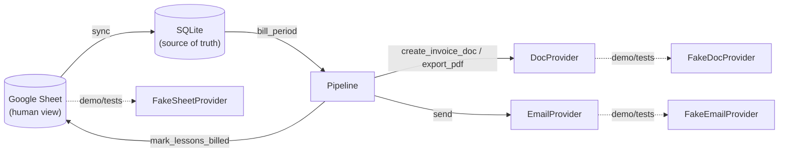
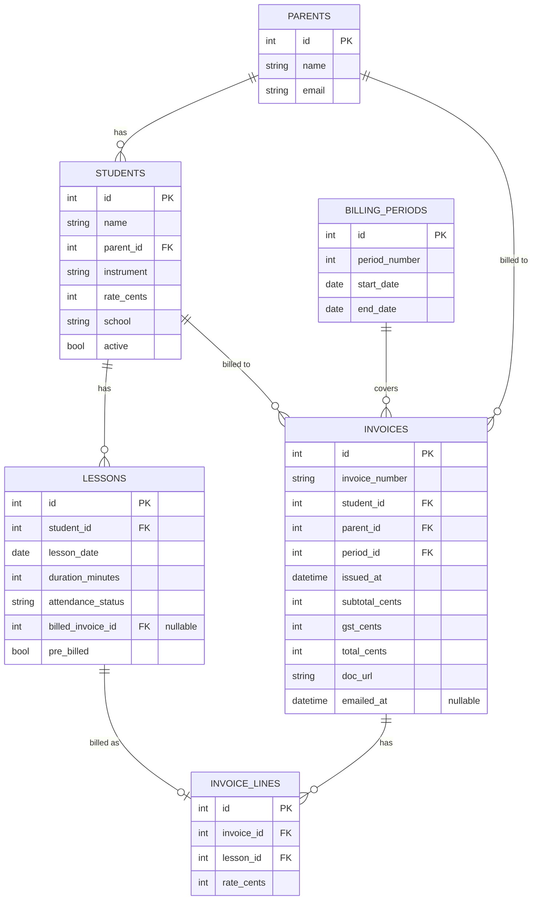

# automated-invoicing-system

Fortnightly tutoring invoicing: bill unbilled lessons, generate invoice documents, email them out — SQLite as the source of truth, Google Sheets as a human-facing view.

[](https://github.com/USERNAME/automated-invoicing-system/actions/workflows/ci.yml)

## The problem

I run a small private tutoring business, and every fortnight I had to work out which lessons hadn't been billed yet, write an invoice for each student, and email it to their parent. The original version of this pipeline did that in about four hours of scripting: a Google Sheet doubled as both the lesson schedule and the billing database, a couple of scripts walked the grid looking for `Y` cells, and a third script copied a Google Doc template, filled in some placeholders, and sent it through Gmail. It worked, and it still runs my actual invoicing today.

It also wasn't testable. Billing state lived entirely in spreadsheet cell values, so "did this lesson get billed" meant re-parsing a grid, and there was no way to run the pipeline against fake data — every test run was a real run against real students, real parents, and a real Gmail account. This repository is a from-scratch rebuild of the same pipeline as a portfolio project: same business rules, same preserved visual output (the invoice email and the invoice document), but built around a real database, tested end to end with zero network access, and safe by default.

## Try it in 30 seconds

```bash
git clone <this-repo>
cd automated-invoicing-system
python -m venv .venv && .venv/Scripts/activate   # or source .venv/bin/activate
pip install -e . ruff mypy pytest pytest-cov
invoicing run --period 3 --demo --no-dry-run --confirm
```

`--demo` swaps in fake Sheets/Docs/Gmail providers and a synthetic dataset (fictional students, `@example.com` addresses) seeded straight into a local `demo.db` — no Google credentials, no network access, nothing external is touched. Real output from that exact command:

```
Period 3: billed 15 new invoice(s).
Emails sent: 15
```

Run it again and nothing new happens — the pipeline already billed those lessons:

```
$ invoicing run --period 3 --demo --no-dry-run --confirm
Period 3: billed 0 new invoice(s).
Emails sent: 0
```

Check overall state at any point:

```
$ invoicing status --demo
Period  Range                     Invoices   Emailed   Pending
--------------------------------------------------------------
1       2026-02-02 - 2026-02-15         18        18         0
2       2026-02-16 - 2026-03-01         18        18         0
3       2026-03-02 - 2026-03-15         15        15         0
4       2026-03-16 - 2026-03-29          0         0         0
5       2026-03-30 - 2026-04-12          0         0         0
6       2026-04-13 - 2026-04-26          0         0         0
```

(Periods 1–2 come seeded as already billed and emailed, so the dataset looks like a business partway through a term, not an empty shell.)

## Architecture

The original made the spreadsheet the database: a lesson's billing state *was* whatever string sat in its status cell, and the only way to answer "what still needs billing" was to re-parse the whole grid. That made two things hard: verifying state (was this lesson actually billed, or did a script just crash after writing the cell?) and testing anything (every run touched the real Sheet, the real Drive, the real Gmail account).

This rebuild makes SQLite the source of truth. `lessons.billed_invoice_id` is a real, queryable column — a lesson is billed if that column is set, or if `pre_billed` is (a second, disclosed signal: `sync` sets it for lessons the Sheet already reported as YI/invoiced before this system existed, since no Invoice row can back a billing decision this system never made). The Sheet becomes a read source (`sync`) and a write-back target (status codes), not the place billing decisions get made. Everything that talks to Google — Sheets, Docs, Drive, Gmail — sits behind three Protocols (`SheetProvider`, `DocProvider`, `EmailProvider`) that the pipeline depends on exclusively; it never imports the concrete Google classes. Every test, and `--demo` mode, wires up in-memory fakes instead — that's what makes the whole thing runnable and testable with zero credentials and zero network access.



## Business rules

The test suite exists to prove these hold, not just to hit a coverage number:

1. **Idempotency** — a lesson is never billed twice. Once `billed_invoice_id` is set, it's excluded from every future query; re-running the pipeline on an already-billed period creates zero new invoices.
2. **Only attended lessons are billable.** Absences (notified or not) are excluded.
3. **Period boundaries are exact and inclusive.** A lesson on a boundary date lands in exactly one 14-day period.
4. **Invoice numbers are unique and follow the preserved scheme** (`DDMMYY` + 2-digit daily sequence) — grounded in a database count, not an in-process rank, so two separate runs on the same day can't collide (the original could).
5. **Totals are correct** — integer cents throughout, no floats. GST is hardcoded to `$0.00`, matching the original exactly: it never calculated GST either. Disclosed simplification, not a solved feature.
6. **Dry-run changes nothing** — no writes to the database, the Sheet, or email.
7. **Partial failure doesn't corrupt state.** Billing and emailing are two independent phases: billing creates an invoice with `emailed_at = NULL`, and a separate phase sends every invoice that's still `NULL`. If a batch email send fails partway through, already-sent invoices stay sent and the rest stay queued — the next run resumes exactly where it left off, never re-billing and never double-sending.

## Data model



## CLI reference

| Command | Flags | Does |
|---|---|---|
| `invoicing sync` | `--demo` \| `--real` (exactly one, required) | Pull the Sheet into SQLite (or seed the synthetic dataset in demo mode). |
| `invoicing preview` | `--period N`, `--demo` | Show what would be invoiced. Read-only, zero writes. |
| `invoicing run` | `--period N`, `--dry-run/--no-dry-run` (default `--dry-run`), `--confirm`, `--demo` \| `--real` (exactly one, required), `--message` | Bill unbilled lessons, then email the results. `--no-dry-run` alone bills but sends nothing; `--confirm` is required to actually send. |
| `invoicing debug-parse-schedule` | `--demo` \| `--real` (exactly one, required) | Read-only: runs only `read_schedule()` and prints the parsed students/lessons. No DB writes, no billing, no email — for checking a SheetProvider's parsing against a real sheet's actual layout before trusting it with `run --real`. |
| `invoicing status` | `--demo` | Summary of every period: invoices, emailed, pending. |
| *(any command)* | `--verbose` | Debug-level logging. |

## Testing

```bash
pytest --cov=src/invoicing --cov-report=term-missing
```

77 tests, 80% line coverage on `src/invoicing`. Coverage is intentionally uneven: `billing.py`, `invoice_numbers.py`, `providers/base.py`, and `seed.py` sit at 100%, while `providers/google.py` sits at 46% — it is *never exercised* by the test suite, by design. A `conftest.py` fixture monkeypatches `socket.socket` to raise on any real connection attempt, so the suite fails loudly if anything ever tried to reach the network; as it stands, nothing does.

- `tests/unit/test_billing.py` — period boundary math, unbilled detection, attendance filtering, integer-cents totals
- `tests/unit/test_idempotency.py` — re-billing produces no duplicates, a billed lesson is never re-billed
- `tests/unit/test_invoice_numbers.py` — format, sequencing, cross-run uniqueness
- `tests/unit/test_templates.py` — every placeholder filled, none survive, HTML escaping, real payment data never appears
- `tests/unit/test_google_sheet_parsing.py` — the real Sheet's blocked weekly-grid layout parses correctly, independent of the API calls around it
- `tests/integration/test_pipeline.py` — full pipeline against fakes: billing, dry-run, re-run idempotency, partial email failure recovery (including a PDF-export failure, not just a send failure), Sheet status write-back, YI-as-already-billed sync, student identity surviving a parent email change
- `tests/integration/test_cli.py` — the actual Typer CLI, including the dry-run/--confirm safety gate

## Safety

- `invoicing run` defaults to `--dry-run` — no writes anywhere unless you explicitly turn it off.
- Turning off dry-run still won't send a single email without also passing `--confirm`. There's no single flag that both bills and emails by accident.
- `.gitignore` blocks `credentials.json`, `token.json`, `*.pickle`, `.env`, and `*.db` from ever being committed — configured before the first commit landed, not after.
- Everything demonstrable in this repo — the seed dataset, README output, this document — is synthetic. No real student, parent, email address, or bank detail appears anywhere in the history.

## Scheduled preview

The domain here is inherently recurring — a fortnight closes, someone has to notice
and decide whether to bill it — but nothing in this repo bills or emails an invoice
unattended, on purpose. [`deploy/scheduled_preview.py`](deploy/scheduled_preview.py)
runs on a weekly [GitHub Actions schedule](.github/workflows/scheduled-preview.yml):
it syncs the Sheet, works out whether the most recently completed period is unbilled,
and **emails the operator a preview** — never `run --confirm`. `sync` and `preview`
are both zero-write from a billing perspective (`preview` makes no writes at all;
`sync` only ever updates SQLite and writes back `YI` for lessons that are already
billed). Billing itself stays a deliberate, manual
`invoicing run --period N --real --no-dry-run --confirm`, run by a human who's just
read the preview email.

This is a direct response to
[the double-billing incident](docs/POSTMORTEM-double-billing.md): that incident
happened because the pipeline trusted its own state without a human checking it
against what had actually changed upstream. Automating the *noticing* is safe and
useful; automating the *deciding* is exactly what went wrong last time.

**Why GitHub Actions and not an Azure Function:** an Azure Function was the first
choice — it's the more relevant signal for the market this portfolio targets — but
the real blocker is credentials, not compute. This pipeline's OAuth flow needs an
interactive browser consent the first time (`InstalledAppFlow.run_local_server`),
which a headless Function can't do; running it there means provisioning a
already-authorized refresh token into Key Vault with managed-identity access ahead of
time, which needs a real Azure subscription to build and test against and pushed this
past a reasonable evening's work. GitHub Actions needed nothing new: this repo
already runs CI there, and its encrypted secrets are enough to hold a pre-authorized
token. If this project ever gets Azure infrastructure elsewhere, moving this specific
job over is a reasonable follow-up, not a redesign.

**Setup**, once you have a token cache already migrated to JSON (see the OAuth section
above — any real `--real` run does this automatically) — as repository **secrets**:
`INVOICING_OAUTH_CLIENT_SECRET_JSON` (the contents of `credentials/credentials.json`),
`INVOICING_OAUTH_TOKEN_JSON` (the contents of `credentials/token.json`), and
`INVOICING_SHEET_ID`; and as repository **variables**: `INVOICING_TERM_START`,
`INVOICING_SCHEDULE_TAB`, `INVOICING_SENDER_NAME`, `INVOICING_SENDER_EMAIL`. Trigger a
run manually from the Actions tab (`workflow_dispatch`) to test it before waiting for
Monday.

## Incidents

- [**Double-billing from a forked student identity**](docs/POSTMORTEM-double-billing.md) (2026-08-16) — a parent's contact email changing between two syncs forked a duplicate student record, and a real run billed and partly emailed 44 invoices instead of 22. Root-caused from the live database, fixed, and covered by a regression test. Full writeup, including what's still open, at the link above.

## What I'd do next

- `mark_lessons_billed` (`providers/google.py:201`) resolves the Sheet cell to write back to by first name only (`ref.student_key.split()[0].lower()`) — the same class of identity-resolution shortcut as the incident above, just in the write-back direction and not yet triggered. See "Remaining risk" in the postmortem.
- `billing_type == "Private"` gating happens at sync time rather than as a stored column, since the target schema doesn't carry it; documented in `pipeline.py`, but a real second billing type (e.g. group lessons) would need it modeled properly.
- Lesson `duration_minutes` is hardcoded to 30 on sync, since the original sheet never recorded it.
- GST is `$0.00`, matching the original — a real second tax jurisdiction would need this implemented for real.
- No multi-tenancy: one `Settings`, one Sheet, one sender identity. Fine for one small business, not for a SaaS version of this.
