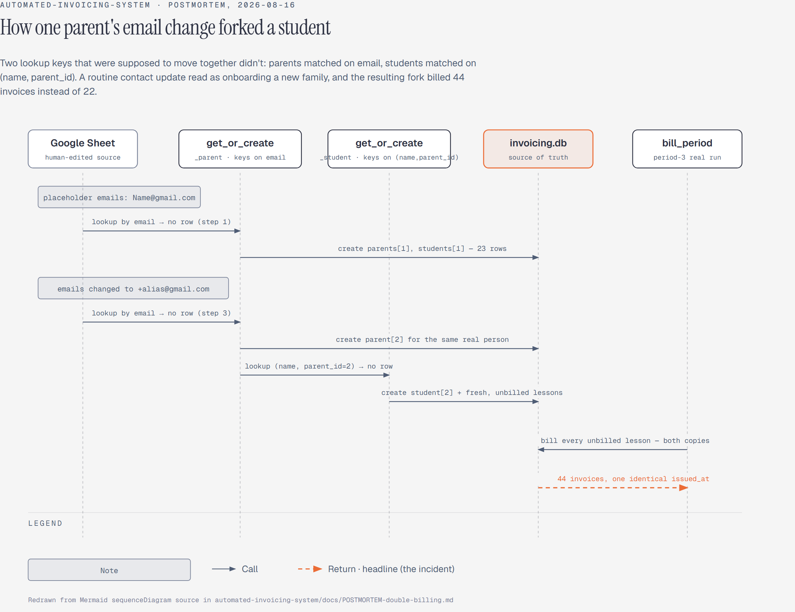
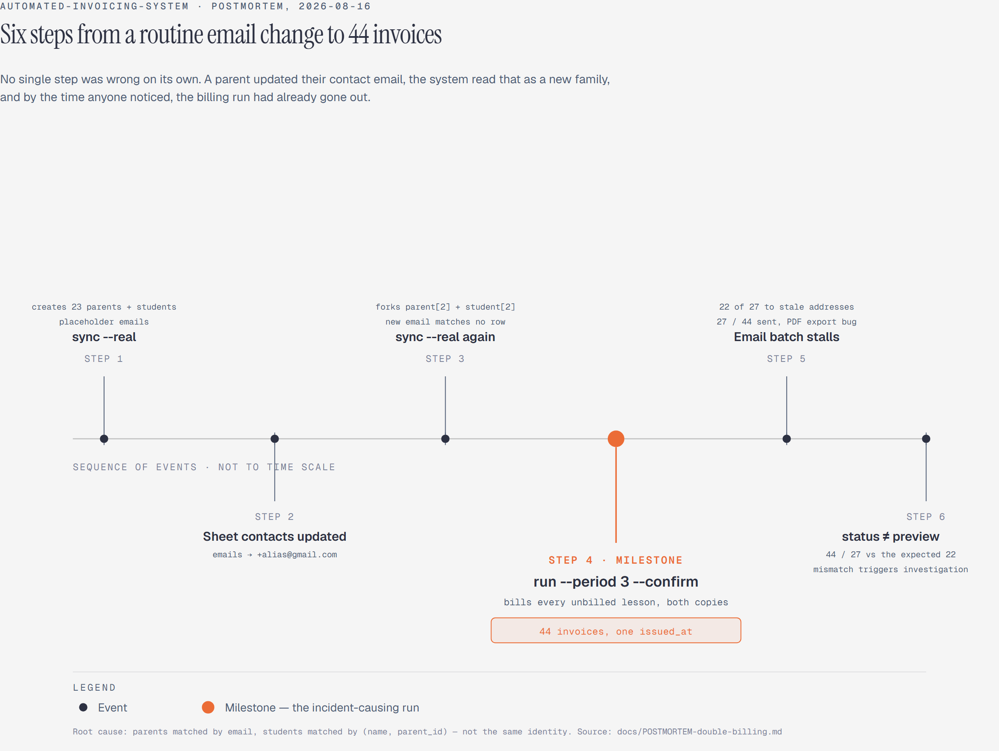

# Postmortem: double-billing from a forked student identity

**Date:** 2026-08-16
**Systems affected:** `sync`, `run --confirm` (real mode only; `--demo` never touches this path)
**Status:** Resolved. One related risk remains open (see "Remaining risk" below).

## Summary

A period-3 real billing run produced 44 invoices instead of 22, and sent 22 of them to
stale, placeholder parent email addresses instead of the correct ones. No lesson was
billed twice. The cause was that 22 real students had silently been duplicated into
46 `students` rows, and `run --confirm` correctly (by its own logic) billed every
distinct, currently-unbilled lesson it found, which by then included two full copies
of the roster.

The fork at a glance:

## Timeline

1. An earlier `sync --real` ran while the source Google Sheet's "Student Config" tab
   held placeholder parent contact addresses in the form `Name@gmail.com`. This
   created 23 `parents` rows and 23 `students` rows, and synced their lessons.
2. The Sheet's parent contact addresses were changed to `+alias@gmail.com` addresses,
   a deliberate, reasonable change to keep test sends contained to one inbox before
   the pipeline was ever pointed at the real business Sheet.
3. A later `sync --real` read the Sheet again. `get_or_create_parent` looks up a
   parent by email. The new email matched no existing row, so a *second* parent was
   created for the same real person. `get_or_create_student` then looked up a student
   by `(name, parent_id)`, and since the parent id was new, that didn't match either,
   so a *second* student was created too, with its own fresh, entirely unbilled
   lesson rows for the same calendar dates as the original.
4. `invoicing run --period 3 --real --no-dry-run --confirm` ran. Its pre-billing sync
   found no further forks (the current-email parent already existed from step 3), then
   `bill_period` scanned every unbilled lesson in the period-3 date range. That query
   has no concept of "student identity" beyond the `lessons.student_id` foreign key.
   It correctly found *both* copies' never-billed lessons and billed all 44 of them in
   a single pass. (Verified directly: every one of the 44 invoices shares one
   identical `issued_at` timestamp, which is only possible from one `bill_period`
   call.)
5. Emailing proceeded in invoice-id order. 27 of the 44 invoices got `emailed_at` set
   before the batch stopped partway through. 22 of those 27 were the *old* copies,
   sent to the stale placeholder addresses; 5 were *new* copies, sent to the correct
   current addresses. The batch most likely stopped because of an adjacent bug found
   while diagnosing this one: `email_pending_invoices` did not wrap
   `docs.export_pdf()` in the same try/except as `email.send()`, so a single
   transient PDF-export failure would abort the whole batch instead of being recorded
   as a per-invoice failure and retried later.
6. `preview --period 3`, run before the batch, had shown 22 students, correct at
   that moment. `status`, run after, showed 44 invoices / 27 emailed / 17 pending.
   That mismatch is what triggered the investigation.

## Impact

- 22 real invoices were emailed to placeholder addresses (`Name@gmail.com`) that were
  never real parent contacts. Not a data leak to a real third party in the sense of
  exposing anything sensitive (the invoice template in use at the time had every
  payment field blank), but a real, unintended send that should not have happened.
- 5 real invoices were correctly emailed to the right parents at that point, before
  the batch stopped.
- 17 invoices were billed but never sent.
- No lesson was billed twice, confirmed directly by checking `invoice_lines` for any
  `lesson_id` referenced by more than one invoice line. There were none. The
  duplication was entirely at the identity layer (parents, students), not the ledger
  layer (lessons, invoice lines).
- After the fix below, the duplicate records were cleaned up, and period 3 was
  correctly re-billed and re-sent as a single clean batch of 22 invoices, all to
  current, correct addresses.

## Root cause

Two different lookup keys were used for two records that are supposed to move
together:

- `get_or_create_parent` matched on **email**.
- `get_or_create_student` matched on **`(name, parent_id)`**.

A parent's email is not a stable identifier for the person. It's a contact detail,
and contact details legitimately change. That's exactly what happened here, and it
was a reasonable, correct operation for the business (nothing about "update this
family's email" should be an exceptional or unsafe action). But because the student
lookup was keyed transitively through the parent's *id* rather than anything about
the student that's actually stable, a routine contact-detail update was
indistinguishable, from the code's point of view, from onboarding a brand new
student. The system had no way to say "this is the same kid, new email", only "have
I seen this exact (name, parent_id) pair before."

## Detection and diagnosis

Diagnosed by direct, read-only inspection of the real `invoicing.db`, not by reading
code in isolation:

- `SELECT COUNT(*) FROM students` returned 46, not the expected 23.
- Every student name appeared exactly twice, each pair with a different `parent_id`.
  For example, `id=1 "Will Lastname"` (`parent_id=1`, email `Will@gmail.com`) and
  `id=24 "Will Lastname"` (`parent_id=24`, email `thomas.mountstephens+will@gmail.com`).
- All 44 period-3 invoices shared one identical `issued_at` timestamp, which meant
  they came from a single `bill_period` call, not two separate runs at different
  times.
- Cross-checking `invoice_lines` confirmed no `lesson_id` was referenced by more than
  one invoice line. That ruled out "the same lesson got billed twice" and confirmed
  "two different lessons for the same real person got billed once each."
- The live Sheet was re-read (read-only) at diagnosis time and correctly showed 23
  students. The fork had already happened before that check, entirely inside the
  local database, and wasn't visible from the Sheet's current state at all. This is
  worth stating plainly: **the Sheet looking correct right now tells you nothing
  about whether the database is currently correct.**

## The fix

`get_or_create_student` now matches on **`name` alone**, and repoints `parent_id` in
place when the resolved parent has changed, instead of creating a new student row.
The old parent row is left unreferenced, not deleted, consistent with the rest of
this codebase's audit-trail style of never deleting historical records.

This is deliberately **not** a generalizable pattern. It's correct here because this
system already treats first name as the authoritative student identity everywhere
else. `sync_schedule_into_db` joins the Lesson Schedule grid to the Student Config
roster purely by first name (`student_ids[record.first_name.lower()]`), so two
different students with the same first name were never actually supported by this
system in the first place. Matching the student lookup on `name` doesn't introduce a
new assumption, it just makes an existing one consistent instead of contradicted in
one place. A system that genuinely needed to support duplicate names would need a
real stable identifier (a student number, not a name), and matching on name there
would be exactly as wrong as matching on email was here.

A regression test now covers this directly:
`test_sync_does_not_fork_a_new_student_when_the_parents_email_changes` in
`tests/integration/test_pipeline.py`. It syncs a student once, bills and emails their
lesson, changes the parent email, syncs again, and asserts there is still exactly one
student row and the already-billed lesson's billed state is untouched.

The adjacent `email_pending_invoices` gap (unguarded `docs.export_pdf()`) was also
fixed in the same pass. PDF export and send are now one unit for failure-handling
purposes, so one bad export fails only that invoice rather than the whole batch.

## What structurally prevents recurrence now

- Student identity resolution has exactly one source of truth (`name`), matching what
  every other part of this codebase already assumed.
- A parent's contact details can now change freely across syncs without forking a new
  person underneath it.
- The regression test above fails if this behavior ever regresses.
- `is_unbilled` (the single predicate that decides what gets billed) is unchanged and
  still correct. This incident was never a flaw in the billing logic itself, only in
  what identity that logic was allowed to see as "the same student."

## Remaining risk

`mark_lessons_billed` (`providers/google.py:201`) resolves which Sheet cell to write
`YI` back to using `ref.student_key.split()[0].lower()`, first name only, the same
identity-resolution shortcut that caused this incident, just in the write-back
direction instead of the sync direction. It has not yet fired, because no two
students in the live roster currently share a first name. But it is the same class
of bug, latent rather than fixed, and is tracked as a follow-up rather than closed
here.

---

## Follow-up (2026-08-21): a schema contract closes the write-back risk above

**This section is later, structural work, added five days after the incident and the fix
above. It was not part of the original fix, and none of it existed at the time this
postmortem was first written.** Everything above this line is the unedited original
record of what happened and what was done about it then.

This follow-up closes the specific risk this postmortem names in "Remaining risk". As of
this session, `mark_lessons_billed` no longer resolves a Sheet cell by
`ref.student_key.split()[0].lower()`. It resolves by the database's stable `student_id`,
via an identity map (`student_id -> first_name`) that `sync_schedule_into_db` builds once,
at sync time, from the same roster join that already creates that identity, not by
re-deriving a first name from a display string on every write-back call. Two students
sharing a first name, which was the specific unfired failure mode named above, now
resolve to two distinct entries instead of colliding.

The broader structural change this session did is a versioned lesson-schedule schema
contract (`docs/SCHEDULE-SCHEMA.md`), backed by a template workbook
(`templates/lesson_schedule.xlsx`) and validation code
(`invoicing.schedule_contract`, `invoicing.workbook`). Its core move is making
`student_id` (text, `S-0001` format, issued once, never derived from a name or an email)
the only identity a student or a scheduled lesson has anywhere in the contract. Name,
rate, and contact details are explicitly attributes, not identity, and can change freely
without ever forking a second student. The database gained a real `student_id` column on
the same principle, minted once per student at insert time and backfilled for existing
databases. Where the original fix (above) made `name` the one lookup key for students in
the database, this follow-up replaces that name-based key with an immutable id
everywhere it's practical to do so, including, now, the write-back direction this
postmortem had left open.

**This does not close every identity risk in the system, and shouldn't be read as if it
does.** `Database.get_or_create_parent` still matches a parent by email, the same shape
of mutable-field lookup that forked the parent row which forked the student row in this
incident's own timeline, one level up the chain. It has not forked a duplicate student
since the original fix landed, because the student lookup no longer depends on which
parent row resolved. But the email-keyed parent lookup itself is unchanged and
unaddressed by this follow-up. `GoogleSheetProvider`'s other heuristics (first-name-only
sync-time matching against the live Sheet's roster, silent skip on an unmatched name,
year inferred rather than read from the sheet) are also unchanged. See
`docs/SCHEDULE-SCHEMA.md`'s "Known limitations" for the full, current list.
